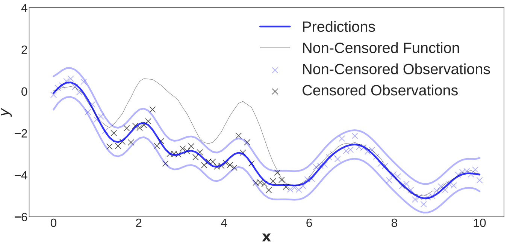
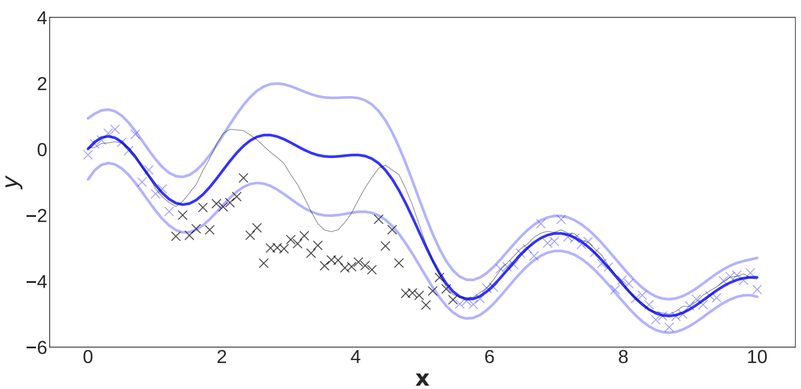
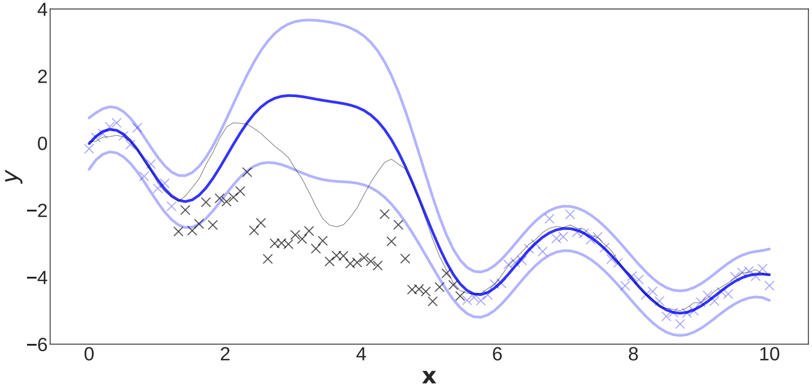
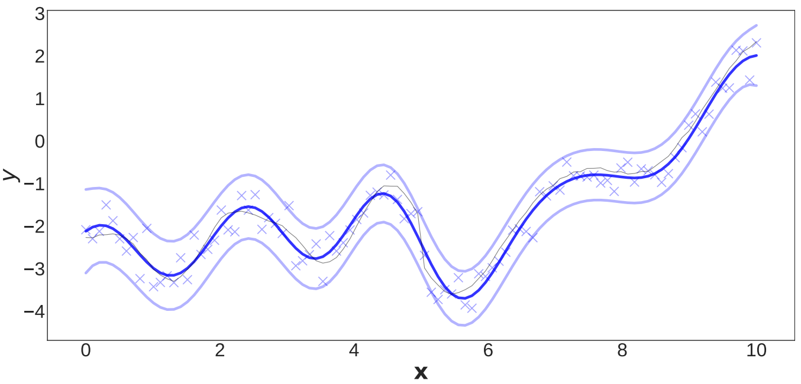
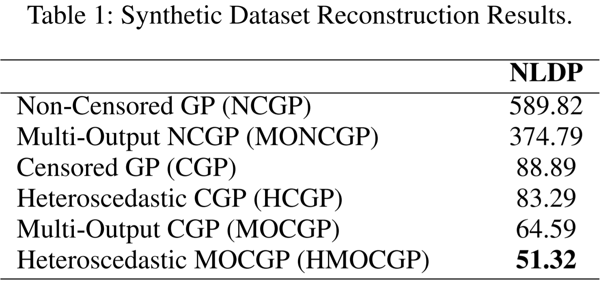
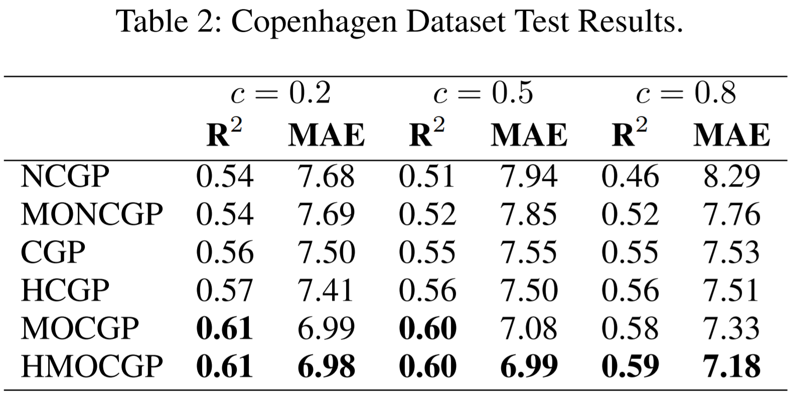
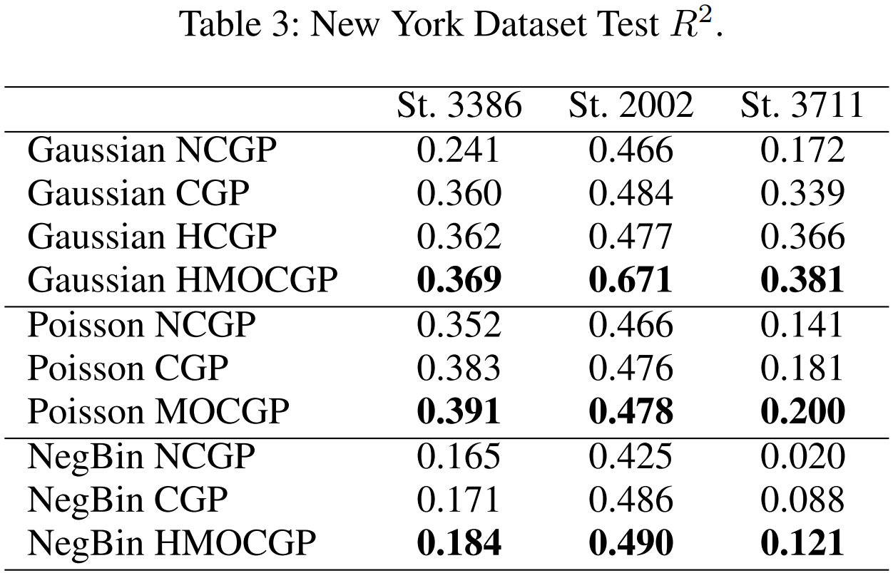

# Coming Soon!
--------------

# Generalized Multi-Output Gaussian Process Censored Regression

This repository is the official implementation of the HMOCGP, from *Generalized Multi-Output Gaussian Process Censored Regression*.

The full paper is available [here](https://arxiv.org/abs/2009.04822)

| | |
|:-------------------------:|:-------------------------:|
| |  |
|  |  |

## Summary

This repository contains:

1. `model.py`: code to implement both homoscedastic and heteroscedastic versions of variational GPs
2. `likelihoods.py`, `distributions.py`: code to implement different likelihoods used in Section 3 of the paper (i.e., censored-Gaussian/Poisson/NegBinomial)
3. `/data`: folder containing data used for the New York Dataset experiment (Section 3)

## Training and Evaluation code

A working Jupyter Notebook is provided in `demo-nyc-bike-station3386-1h.ipynb`, replicating results for the NYC task (more details in Section 3 of the paper).

The notebook contains:

1. TODO
2. TODO
3. TODO

## Summary of results

In our work, we show how the proposed model is able to achieve better performance in capturing the latent non-censored process on a variety of different tasks. Below is a summary of the presented results:

</td>
</td>
</td>
